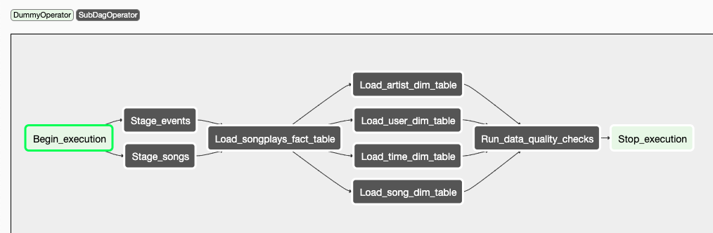

# Data Pipelines with Airflow

### Summary

A music streaming company, Sparkify, has decided that it is time to introduce more automation and monitoring to their data warehouse ETL pipelines with Apache Airflow. The source data resides in S3 and needs to be processed in Sparkify's data warehouse in Amazon Redshift. The source datasets consist of JSON logs that tell about user activity in the application and JSON metadata about the songs the users listen to.

We need to build high grade data pipelines that are dynamic and built from reusable tasks, can be monitored, and allow easy backfills. Data Quality plays a big part when analyses are executed on top the data warehouse and want to run tests against their datasets after the ETL steps have been executed to catch any discrepancies in the datasets.

### Project Description

Build a Data Pipeline with Apache Airflow using custom subdags & operators  to perform tasks such as staging the data from S3 to Redshift, fill the data warehouse (fact & dimension tables), and run data quality checks.

### Pre-Requisites
* AWS Redshift Cluster, KeyPair (Read Amazon S3)
* Apache Airflow

### How to Run & Test
* Start Airflow Webserver & Scheduler and add 'aws-credentials' & 'redshift' connection parameters
* Enable 'dend_dpl_dag' and Run ETL Pipeline. 
* Review GraphView for Data Flow and Monitor TreeView for Execution Results.
* Review logs of tasks from 'Run_data_quality_checks' subdag.

### Files
| Filename |  |
| ------ | ------ |
| dags/dend_dpl_dag.py | Primary  DAG to create subdags that Stages dataset from S3 to Redshift, Creates Fact & Dimension tables, Runs data quality checks. | 
| dags/stage_redshift_subdag.py | SubDAG that creates staging tables and copies data from S3 to Redshift. | 
| dags/load_fact_subdag.py | SubDAG that creates Fact table and inserts data from staging table. | 
| dags/load_dim_subdag.py | SubDAG that creates Dimension tables and inserts data from staging table. | 
| dags/data_quality_subdag.py | SubDAG that runs data quality checks. | 
| plugins/operators/stage_redshift.py | Operator that copies data from S3 to Redshift. | 
| plugins/operators/load_fact.py | Operator that inserts data to Fact table from staging tables. | 
| plugins/operators/load_dimension.py | Operator that inserts data to Dimension tables from staging tables. | 
| plugins/operators/data_quality.py | Operator that runs data quality checks on a specific table. | 
| plugins/helpers/sql_tables.py | Redshift queries to create & drop tables. | 
| plugins/helpers/sql_queries.py | Redshift queries to copy & insert data into the tables, etc. | 

### Table Design
##### Staging Tables  
- staging_events_table
- staging_songs_table

##### Dimension Tables
- songs
- artists
- users
- times

##### Facts Table
- songplays

##### GraphView

### Acknowledgement
Author: Hari Raja
Framework: Udacity
Date: Jun 3 2020
